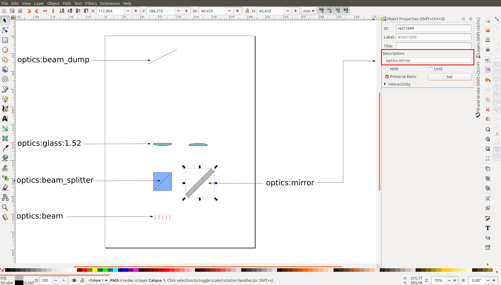

Inkscape Ray Optics
===================


An extension for Inkscape that makes it easier to draw optical diagrams. 

Allows to annotate Inkscape primitives with optical properties and draws beam paths by taking into account reflection and refraction. 

---

# Examples


# How to install 
Copy the extension directory in inkscape user extensions directory. 

Typically for Linux users:
  ```shell
  cd ~/.config/inkscape/extensions
  git clone https://github.com/damienBloch/inkscape-raytracing
  ```
  
Requires python3.6 or above with numpy and Inkscape1.0 or above. 


# How to use

## 1. For each optical element or group of elements, select it and choose its material with Extenstions/Optics/Set material as:

The material can be one of the following:

  * `Beam`: source of the ray. Need at least one element with this property to see an effect. Typically the element should be a straight line.
  * `Mirror`: reflects an incoming beam. Element can be a closed or open shape.
  * `Beam dump`: absorbs all incoming beams. Element can be a closed or open shape.
  * `Beam splitter`: for each incoming beam, produces one transmitted beam and one reflected beam. Element can be a closed or open shape, but closed shape will cause the number of beams to increase exponentially.
  * `Glass`: with optical index. Transmits and bends a beam depending on its optical index. **Element must be a closed shape**.

This will automatically write some text in the element description. This text is used to reccord the properties of the elements. It is also possible to directly write the text in the description.


  
An element can have at most one optical property and will be ignored if it has two or more.

It is possible to add complementary text in the description. If it doesn't have the syntax `optics:<something>`, the extra text will simply be ignored.


## 2. Select the elements to render and run the extension:


## 3. This will trace all the beams originated from an `optics:beam` element:


Note that the borders of the document blocks the beams and all objects outside the document page will be ignored.


# Known limitations

* Cannot write the properties in a group description. They must be written in the primitives description. 
* Avoid overlapping or touching elements. It won't cause Inkscape to crash, but might give unexpected results.
* The same goes for self-intersecting paths.
* ~~Because of a potential [issue](https://gitlab.com/inkscape/extensions/-/issues/335) with Inkscape python extensions, transformations like rotations or reflections are not always correctly applied to groups of elements, rectangles and ellipses. This might cause the ray tracing to output blatantly wrong results or to seemingly ignore some objects. A possible workaround is to ungroup all objects and convert them to path before applying any rotation or reflection. WIP.~~     
